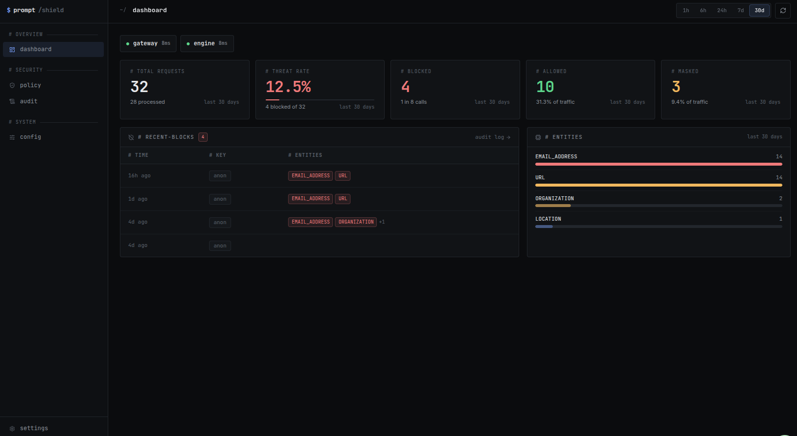

# PromptShield

<p align="center">
	
</p>

<p align="center">
	<strong>Open source LLM gateway with PII and secret detection built in.</strong>
</p>

<p align="center">
	<em>Runs on your infrastructure.</em>
</p>

<p align="center">
	<a href="https://promptshield-docs.vercel.app/docs/quickstart">Quickstart</a> ·
	<a href="https://promptshield-docs.vercel.app">Docs</a> ·
	<a href="./apps/docs/content/docs/contributing.mdx">Contributing</a>
</p>

PromptShield sits between your application and any LLM provider. Every request passes through the proxy, which calls the detection engine to scan for PII, leaked secrets, etc and blocks or masks before the model ever sees them. Policy is a single YAML file, hot-reloadable, editable from the dashboard.

This repository contains the dashboard, API server, and shared packages. The proxy and detection engine live in separate repos and are required for full scanning:

- **Proxy** (Go): [promptshieldhq/promptshield-proxy](https://github.com/promptshieldhq/promptshield-proxy)
- **Engine** (Python): [promptshieldhq/promptshield-engine](https://github.com/promptshieldhq/promptshield-engine)


## Running locally

**With Docker (recommended):**

```bash
cp .env.local.example .env.local
# fill in BETTER_AUTH_SECRET (any 32+ char string) and a provider API key

docker compose -f docker-compose.dev.yml up --build
```

| Service    | URL                   |
| ---------- | --------------------- |
| Dashboard  | http://localhost:8000 |
| API server | http://localhost:3000 |
| Proxy      | http://localhost:8080 |
| Engine     | http://localhost:4321 |
| Docs       | http://localhost:4000 |

**Without Docker:**

```bash
bun install

cp apps/server/.env.example apps/server/.env
cp apps/web/.env.example apps/web/.env
# fill in BETTER_AUTH_SECRET and DATABASE_URL

cd packages/db && bunx drizzle-kit migrate && cd ../..

bun run dev:server  # API server  → :3000
bun run dev:web     # Dashboard   → :8000
bun run dev:docs    # Docs        → :4000
```

## Contributing

See [CONTRIBUTING](./apps/docs/content/docs/contributing.mdx).

## Security

Report vulnerabilities via [GitHub Security Advisory](https://github.com/promptshieldhq/promptshield/security/advisories/new), not public issues. See [SECURITY.md](./SECURITY.md).

## License

[MIT](./LICENSE)
